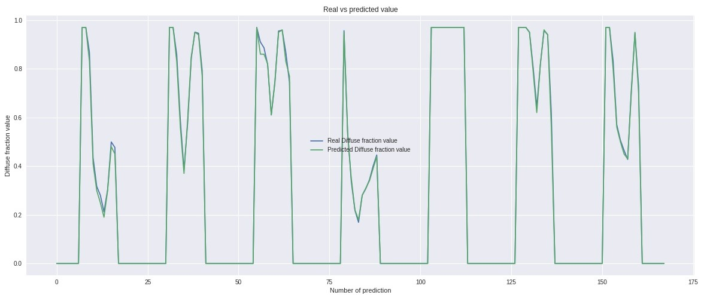

# NeuralNetworkPrediction
This is the repository for all the files related to my reseach internship in Japan. This includes the final presentation, the report and the code.

In this project, an Artificial Neural Network was used to predict hourly the diffuse fraction at Nagaoka city in Japan, using global radiation, date and time as input parameters. The data set used was obtained by the system (Japan Meteorological Agency, AMeDAS) for the period (1981-2000), of which 15 years (1981-1995) were taken for training, 2 years for validation (1996-1997) and 3 years as an isolated data set (1998-2000) for testing. The model did not show perfect accuracy, however it made very close predictions, due to the way the neural network was created. The forecast was made by classification instead of non-linear regression with Feedforward Neural Network architecture composed of 3 hidden layers with 128 neurons each. The aim of this research is to develop a model to correlate diffuse fraction and global irradiance and thus provide researchers a sub-neural network in their neural networks since these results can be used as inputs to other neural networks, this will contribute to create more accurate models with a higher number of inputs and that they can improve certain applications and solar devices.

# Architecture

# Findings

The most interesting thing about this project from my point of view, was that better results were obtained using classification than regression in a problem where regression would normally be chosen. How? Instead of taking numbers as numbers, I took numbers as classes, from 0.00 to 1.00.
If the model predicted a class "0.73" where "0.72" was the real class, even though you get relatively low accuracy because of not matching the correct class, the answer is actually close to the real value. Take a look at the report for more details.

### Example: Results of the hourly prediction for the first **day**

| Hour | Real Kd value | Predicted Kd value | Absolute error |
| ---- | ------------- | ------------------ | -------------- |
| 0    | 0             | 0                  | 0              |
| 1    | 0             | 0                  | 0              |
| 2    | 0             | 0                  | 0              |
| 3    | 0             | 0                  | 0              |
| 4    | 0             | 0                  | 0              |
| 5    | 0             | 0                  | 0              |
| 6    | 0             | 0                  | 0              |
| 7    | 0.97000001    | 0.97               | 1.23E-08       |
| 8    | 0.97000006    | 0.97               | 5.93E-08       |
| 9    | 0.86711109    | 0.83               | 0.03711109     |
| 10   | 0.43543397    | 0.41               | 0.02543397     |
| 11   | 0.31704194    | 0.3                | 0.01704194     |
| 12   | 0.28052002    | 0.25               | 0.03052002     |
| 13   | 0.21232163    | 0.19               | 0.02232163     |
| 14   | 0.30333815    | 0.3                | 0.00333815     |
| 15   | 0.49943553    | 0.48               | 0.01943553     |
| 16   | 0.47658918    | 0.45               | 0.02658918     |
| 17   | 0             | 0                  | 0              |
| 18   | 0             | 0                  | 0              |
| 19   | 0             | 0                  | 0              |
| 20   | 0             | 0                  | 0              |
| 21   | 0             | 0                  | 0              |
| 22   | 0             | 0                  | 0              |
| 23   | 0             | 0                  | 0              |
| 24   | 0             | 0                  | 0              |

### Example: Results of the hourly prediction for the first **week**

# Presentation
[Download it here](Final%20presentation.pptx)

# Report
[Read it here](Using%20Neural%20Network%20to%20Predict%20Diffuse%20Fraction%20kd%20(Ratio%20of%20the%20Diffuse-to-Global%20Solar%20Radiation).pdf)

# Code
[Open Jupyter Notebook preview here](NeuralNetworkForPV.ipynb)

I suggest you to open it with Google Colab if GitHub does not load the preview.

# Contact

For any questions please contact me.
e-mail: oa.santosmunoz@ugto.mx

